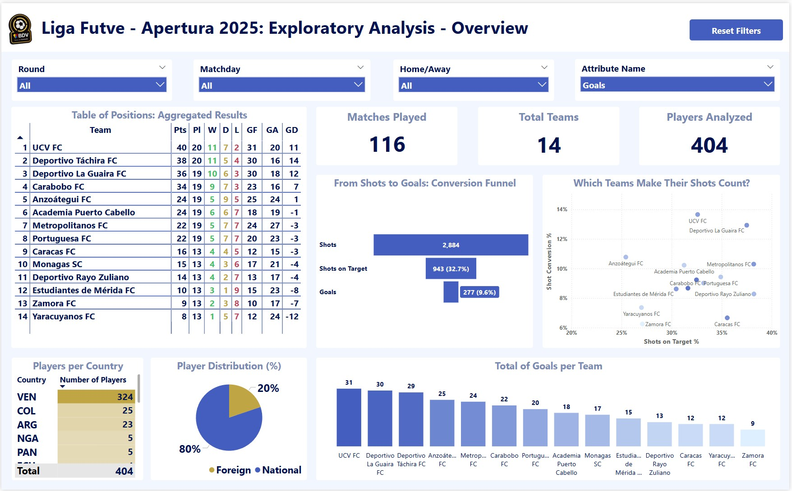

# Venezuelan Primera División 2025 – Dashboard Project

This project builds an educational dashboard for the **2025 Venezuelan Primera División** season, the first tear in venezuelan football.

I collected match and player data, cleaned it, and organized it.  
The final dashboard tracks team performances, player stats, goals, wins, losses, and standings across the season.

---

## 📋 Project Summary

Main steps to achieve the final dashboard:

- Scraped match schedules and player statistics from **FBref.com** using Python.
- Cleaned and enriched the data with matchday information and player metrics.
- Built a structured data model with goals scored and goals conceded per match and team.
- Designed a Power BI dashboard showing competition overview and team performances.

---

## 📸 Screenshot

### Dashboard Overview

---

## ⚡ Technologies Used

- **Python** (for web scraping)
- **Power Query** (for ETL)
- **Power BI** (for modeling and making the dashboard)

---

## 📅 Project Status

✅ Web scraping completed  
✅ Data model created  
✅ Dashboard built  
🔜 Additional team-focused/player-focused pages (future work)
